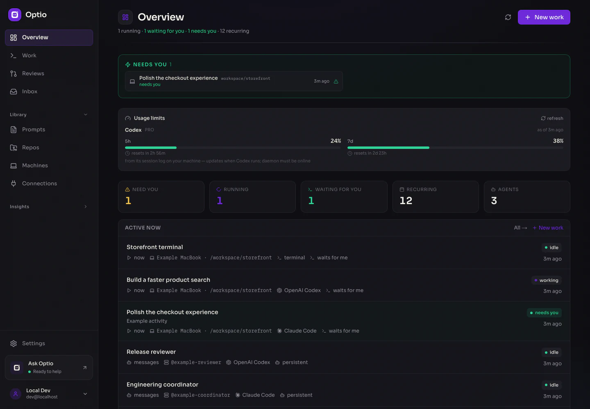
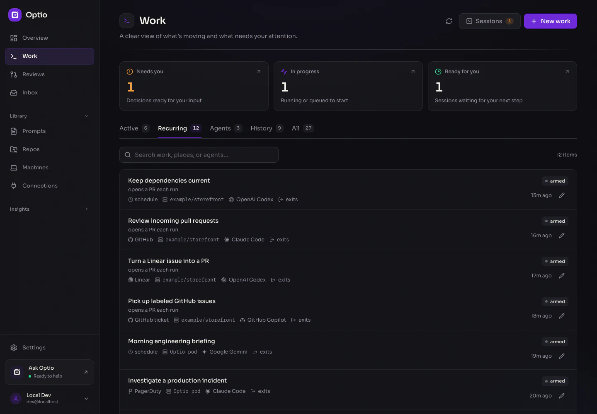
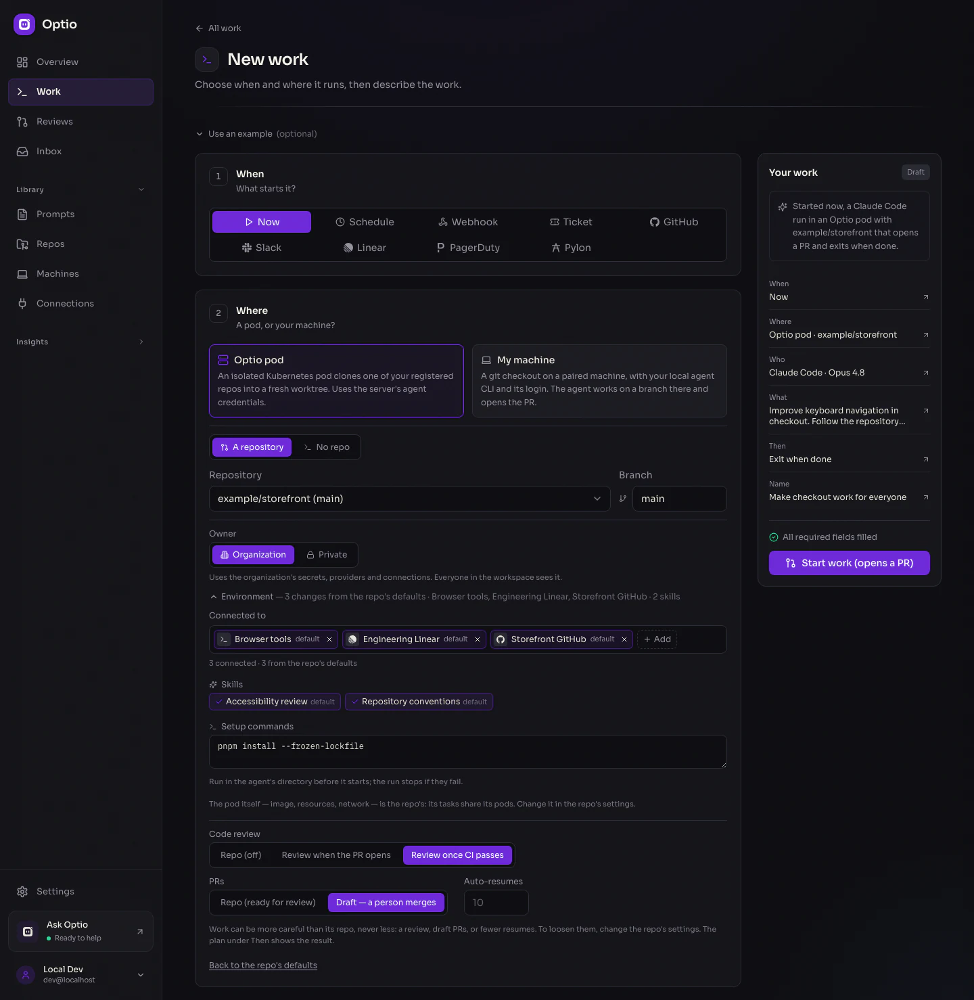
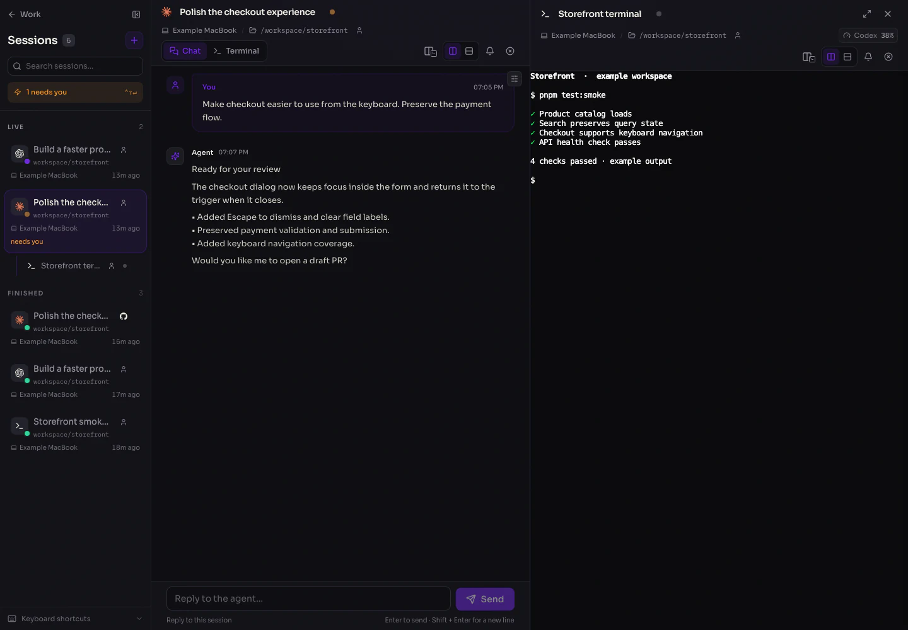
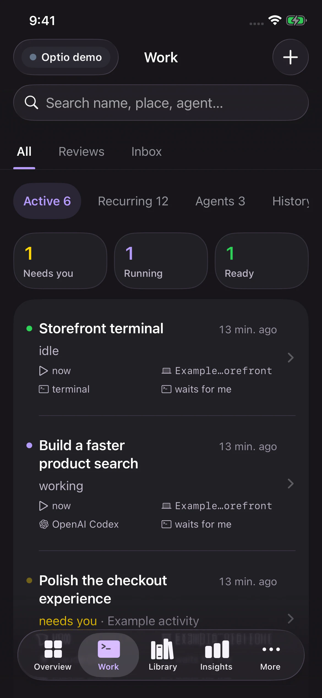
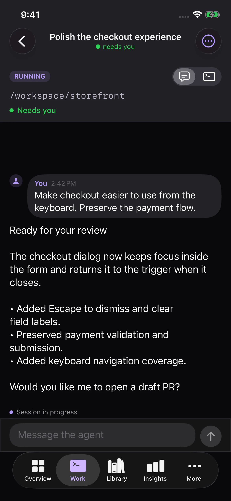
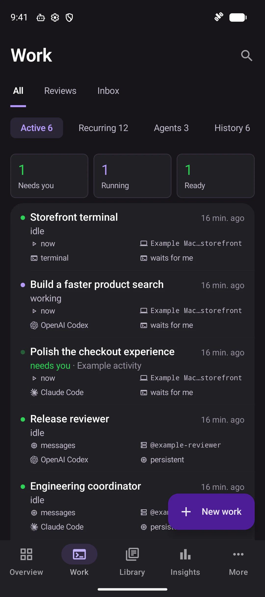
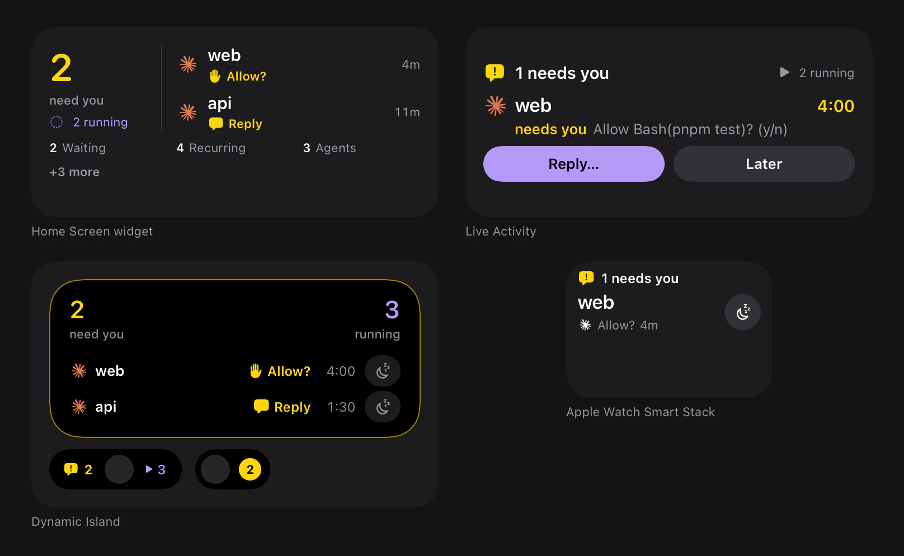

<div align="center">
  
  <h1>Optio</h1>
  <p><strong>All your agent work. One place to run it.</strong></p>
  <p>Self-hosted orchestration for coding agents, automated workflows, and interactive sessions.<br />On your Kubernetes cluster. On your own machines. In your pocket.</p>
  <p><a href="https://optio.host">Product tour</a> · <a href="https://optio.host/docs/getting-started/">Get started</a> · <a href="https://optio.host/docs/">Documentation</a> · <a href="https://github.com/jonwiggins/optio/releases">Releases</a></p>

[](https://github.com/jonwiggins/optio/actions/workflows/ci.yml)
[](./LICENSE)

</div>



_Know what is running, what is ready, and what needs you. All screenshots use fictional demonstration data; activity and usage are simulated._

Optio gives your agents a shared workspace. Hand off a code change, schedule a report, respond to an event, or keep a terminal open while you move between your desk and your phone. Start and follow all of it from one **Work** feed.

Choose **Claude Code, OpenAI Codex, GitHub Copilot, Google Gemini, Cursor, OpenCode, or OpenClaw**—or run a plain shell command. Pick the runtime for each piece of work, with the models and providers it supports.

## What can you do with Optio?

| Put an agent to work on…                          | Start it with…                                  | What happens                                                                                                             |
| ------------------------------------------------- | ----------------------------------------------- | ------------------------------------------------------------------------------------------------------------------------ |
| **An issue → a pull request**                     | A prompt, ticket, GitHub event, or Linear event | Work in a repo worktree, open a PR, follow CI and review, and resume with feedback. Merge automatically when configured. |
| **Dependency updates and daily briefings**        | A cron schedule                                 | Run saved instructions on a schedule, with a separate history for each run.                                              |
| **Incidents and failed deployments**              | PagerDuty or a webhook                          | Turn event payloads into prompt parameters; investigate with the tools and credentials you assign.                       |
| **Engineering questions and support escalations** | Slack or Pylon                                  | Research the request, prepare an answer, and leave the next decision to a person when your instructions call for it.     |
| **Work in your own checkout**                     | A manual session or an event                    | Run an agent or terminal on a paired machine with its existing CLI login.                                                |
| **A team of specialists**                         | Messages, schedules, or events                  | Give persistent agents their own instructions and inboxes. Coordinate them through the inter-agent API.                  |
| **Routine shell checks**                          | Manual, schedule, or another trigger            | Run a command without an LLM; track its output and exit status.                                                          |
| **A session with a teammate**                     | An expiring share link                          | Let an authenticated organization member view and control the session; revoke access when finished.                      |

The nine trigger types are **manual, schedule, webhook, ticket, GitHub, Slack, Linear, Pylon, and PagerDuty**. Persistent agents can also wake on messages. GitHub, GitLab, and AWS CodeCommit are supported repository platforms; available CI and issue features depend on the platform.



_Repo work, jobs, local automations, and persistent agents share the same feed._

## Five answers describe the work

|           | Your choice                                                                    |
| --------- | ------------------------------------------------------------------------------ |
| **When**  | Start now, on a schedule, from a ticket or event, or when a message arrives.   |
| **Where** | A pod in your cluster, with or without a repo, or a directory on your machine. |
| **Who**   | An agent runtime with its parameters, or a terminal.                           |
| **What**  | A prompt, a reusable template with `{{params}}`, or a shell command.           |
| **Then**  | Exit when done, wait for you, or stay available as a persistent agent.         |

The form derives the right kind of work from these choices and reads it back as a sentence. Edit recurring work in the same form.



_Choose a trigger, then shape the environment: pod or machine, repository and branch, ownership, connections and MCP tools, skills, setup commands, and PR review settings. Follow the repo's defaults or customize this piece of work._

## Stay close to your sessions

Read the agent’s conversation or use its terminal. Open a shell in the same directory with **Terminal here**, split sessions side by side, and drag the session sidebar to the width you want. Pane arrangements stay on the current device.



Session sharing requires organization sign-in and grants **view and control**. Links expire and can be revoked. Collaborators gain access to the session’s environment and capabilities, including credentials available there. [Sharing and recovery details →](docs/production-eks.md)

## Native apps, wherever you are

Optio has a **SwiftUI iOS app** and a **Jetpack Compose Android app**. Check the queue, create work, read conversations, control terminals, and manage your workspace from your phone.

<p align="center">
  
  &nbsp;
  
  &nbsp;
  
</p>

**iOS:** home-screen and Lock Screen widgets, Live Activities, Dynamic Island, and a mirrored Live Activity in the **Apple Watch Smart Stack**. **Android:** home-screen widgets, notifications, and an ongoing watch notification. Contextual actions take you back to the work that needs you.



_Native Apple component captures with sample states. Watch support is provided by the iPhone Live Activity; there is no separate Watch app._

[Build iOS](apps/ios/README.md) · [Build Android](apps/android/README.md) · [More screenshots](https://optio.host/#gallery)

## Your infrastructure, your choices

- **Cluster and laptop execution.** Repository work uses worktrees in Kubernetes; Optio Local pairs your machines through an outbound connection and uses their CLI configuration.
- **Connections and tools.** Combine encrypted credentials, MCP servers, shell environment, and usage notes. Assign access by repo and runtime, with per-work settings. [Connections →](docs/connections.md)
- **Explicit ownership and isolation.** Execution pools include workspace, owner, purpose, and access settings. Work inside the same pool remains mutually trusted; ordinary pods are not a boundary for hostile tenants. [Security review →](docs/security-review-2026-10.md)
- **Recovery with visible status.** Sessions report reconnecting, resumable, or lost states. Preserve recoverable work and require an explicit decision before retrying an uncertain outcome. [Recovery →](docs/production-eks.md)
- **Managed Kubernetes deployment.** Helm supports managed PostgreSQL and Redis, existing Kubernetes Secrets for database, Redis, encryption, and OAuth settings, and separate worker identities. The combined API/web deployment currently requires **one replica**; worker pods scale independently. [EKS and production guide →](docs/production-eks.md)
- **Identity and access.** Workspaces, admin/member/viewer roles, OAuth/OIDC sign-in, personal access tokens, and encrypted secrets at rest. [Sign-in →](docs/sign-in.md)

Optio is the orchestration layer you host. Agents still communicate with the model providers and external tools you configure; self-hosting Optio does not make those services local.

## Get started

For a local deployment, install Docker Desktop and enable Kubernetes, then:

```bash
git clone https://github.com/jonwiggins/optio.git
cd optio
./scripts/setup-local.sh
```

Open **http://localhost:30310** and complete setup. The API listens at **http://localhost:30400**. The setup script builds the project and deploys it to local Kubernetes; see the [installation guide](https://optio.host/docs/installation/) for prerequisites and other deployment options.

For production, use the [Helm chart](helm/optio/) and [managed deployment guide](docs/production-eks.md). Agent providers and infrastructure may have their own costs.

Want a workspace to explore? [Seed the example catalog](scripts/showcase/README.md). It adds clearly labeled, paused examples without running agents, contacting integrations, or replacing existing work.

## Explore further

| Guide                                                 | What it covers                                          |
| ----------------------------------------------------- | ------------------------------------------------------- |
| [Work and tasks](docs/tasks.md)                       | Repo tasks, jobs, recurring definitions, and lifecycle  |
| [Optio Local](docs/optio-local.md)                    | Pair machines, terminals, automations, and transcripts  |
| [Persistent agents](docs/persistent-agents.md)        | Inboxes, turn loops, agent messaging, and pod lifecycle |
| [Example agent teams](examples/persistent-agents/)    | Forge and Mars Mission Control                          |
| [Connections](docs/connections.md)                    | Credentials, MCP tools, environment, and skills         |
| [Configuration as code](docs/config-as-code.md)       | Keep workspace configuration in a repository            |
| [Reconciliation](docs/reconciliation.md)              | How the control plane follows work and recovers         |
| [Contributing](https://optio.host/docs/contributing/) | Architecture, development setup, and tests              |

Built with TypeScript, Next.js, Fastify, PostgreSQL, Redis/BullMQ, and Kubernetes, with native Swift and Kotlin clients. See [CLAUDE.md](CLAUDE.md) for repository conventions and the test matrix.

[MIT licensed](LICENSE).
